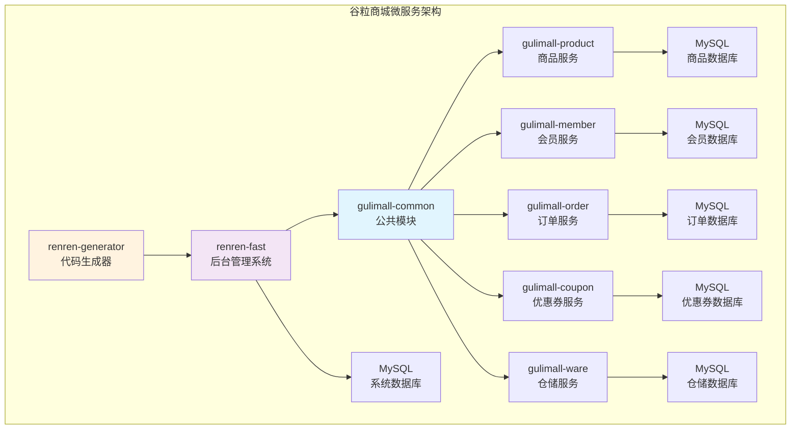

# 谷粒商城 (gulimall) 项目分析报告

## 1. 项目概述

### 项目介绍
谷粒商城是一个基于Spring Boot和Spring Cloud构建的电商系统项目，采用微服务架构设计。项目包含了电商系统的核心业务模块，如商品管理、会员管理、订单管理、优惠券管理、仓储管理等，同时集成了人人开源的快速开发框架作为后台管理系统。

### 技术栈
- **后端框架**: Spring Boot 3.3.0 / Spring Boot 2.6.6
- **微服务**: Spring Cloud 2023.0.3
- **数据访问**: MyBatis-Plus 3.5.7
- **数据库**: MySQL 8.4.0
- **Java版本**: Java 17 / Java 8
- **构建工具**: Maven
- **服务通信**: OpenFeign
- **安全框架**: Apache Shiro 1.9.0
- **权限管理**: JWT Token
- **前端技术**: Vue.js (基于renren-fast的UI框架)

### 核心功能
- **商品管理**: SPU/SKU管理、商品分类、品牌管理、属性管理
- **会员管理**: 会员信息、积分管理、等级管理
- **订单管理**: 订单创建、支付、发货、退款
- **优惠券系统**: 优惠券创建、发放、使用
- **仓储管理**: 库存管理、入库出库、仓库维护
- **后台管理**: 系统管理、定时任务、文件上传、权限控制

## 2. 模块关系图

## 3. 各个子模块详情分析

### 3.1 gulimall-common (公共模块)

**模块类型**: Core/Component 模块
**主要职责**: 提供项目内部的公共代码和工具类

**核心组件**:
- **分组验证**: 提供阿里云、腾讯云、七牛云等不同场景的分组验证
- **工具类**: 包含常量定义、分页工具、查询封装、统一返回结果(R类)
- **XSS过滤**: HTML和SQL注入过滤工具
- **数据访问**: MyBatis-Plus集成、数据库连接配置

**技术特点**:
- 作为内部SDK，不对外发布
- 被所有业务模块依赖
- 提供统一的数据库访问和工具方法

### 3.2 gulimall-product (商品服务)

**模块类型**: API 模块
**主要职责**: 提供商品相关的HTTP API服务

**核心业务实体**:
- **SPU (Standard Product Unit)**: 标准化产品单元，如iPhone 14
- **SKU (Stock Keeping Unit)**: 库存量单位，如iPhone 14 128GB 黑色
- **商品分类**: 层级商品分类体系
- **品牌管理**: 商品品牌信息维护
- **商品属性**: 规格参数和销售属性管理

**控制器列表** (27个REST接口):
- AttrController - 商品属性管理
- SpuInfoController - SPU信息管理
- SkuInfoController - SKU信息管理
- CategoryController - 商品分类管理
- BrandController - 品牌管理
- 其他12个业务控制器

**数据表设计**:
- pms_spu_info (SPU信息表)
- pms_sku_info (SKU信息表)
- pms_category (分类表)
- pms_brand (品牌表)
- pms_attr (属性表)

### 3.3 gulimall-member (会员服务)

**模块类型**: API 模块
**主要职责**: 会员信息管理和用户服务

**功能特点**:
- 会员注册、登录
- 会员等级管理
- 积分系统
- 收货地址管理

**当前状态**: 模块结构已建立，具体业务代码待完善

### 3.4 gulimall-order (订单服务)

**模块类型**: API 模块
**主要职责**: 订单生命周期管理

**预期功能**:
- 订单创建与提交
- 订单状态流转
- 支付集成
- 物流跟踪
- 退款/售后处理

**当前状态**: 模块结构已建立，具体业务代码待完善

### 3.5 gulimall-coupon (优惠券服务)

**模块类型**: API 模块
**主要职责**: 优惠券系统管理

**预期功能**:
- 优惠券模板创建
- 优惠券发放
- 优惠券使用规则
- 营销活动管理

**当前状态**: 模块结构已建立，具体业务代码待完善

### 3.6 gulimall-ware (仓储服务)

**模块类型**: API 模块
**主要职责**: 库存和仓储管理

**预期功能**:
- 商品库存管理
- 入库出库操作
- 仓库信息维护
- 库存预警机制

**当前状态**: 模块结构已建立，具体业务代码待完善

### 3.7 renren-fast (后台管理系统)

**模块类型**: API 模块 + Runner 模块
**主要职责**: 提供完整的后台管理功能

**系统架构**:
- **系统管理模块**: 用户、角色、菜单、权限管理
- **定时任务模块**: 基于Quartz的分布式任务调度
- **文件管理模块**: 支持阿里云OSS、七牛云、腾讯云COS
- **APP模块**: 移动端API接口和JWT认证

**技术特性**:
- Apache Shiro权限控制
- JWT Token认证
- 多数据源支持
- Redis缓存集成
- Swagger API文档
- XSS安全防护

**数据库设计**:
- sys_user (系统用户表)
- sys_role (角色表)
- sys_menu (菜单表)
- schedule_job (定时任务表)
- sys_oss (文件上传表)

### 3.8 renren-generator (代码生成器)

**模块类型**: 工具模块
**主要职责**: 自动生成CRUD代码

**功能特点**:
- 基于数据库表结构生成代码
- 支持MySQL、Oracle、SQL Server
- 生成Entity、Dao、Service、Controller
- 生成Vue前端页面
- 自定义模板支持

## 4. 项目架构特点

### 4.1 微服务架构
- 采用Spring Cloud微服务架构
- 服务间通过OpenFeign进行通信
- 每个服务独立部署、独立数据库

### 4.2 领域驱动设计
- 按照电商业务领域划分服务边界
- 商品、订单、会员、库存等核心业务独立成服务
- 符合电商系统的业务逻辑分层

### 4.3 快速开发
- 集成renren-fast快速开发平台
- 代码生成器提高开发效率
- 统一的基础框架和工具类

### 4.4 技术栈现代化
- 使用Java 17和Spring Boot 3.x
- MyBatis-Plus简化数据访问
- Vue.js现代化前端框架

## 5. 项目状态评估

### 5.1 已完成模块
- **gulimall-common**: ✅ 完整实现
- **gulimall-product**: ✅ 核心业务完整
- **renren-fast**: ✅ 后台管理系统完整
- **renren-generator**: ✅ 代码生成器完整

### 5.2 待完善模块
- **gulimall-member**: 🔄 基础结构已建立
- **gulimall-order**: 🔄 基础结构已建立
- **gulimall-coupon**: 🔄 基础结构已建立
- **gulimall-ware**: 🔄 基础结构已建立

该项目是一个典型的电商微服务架构示例，适合作为学习和实践Spring Cloud微服务开发的优秀案例。